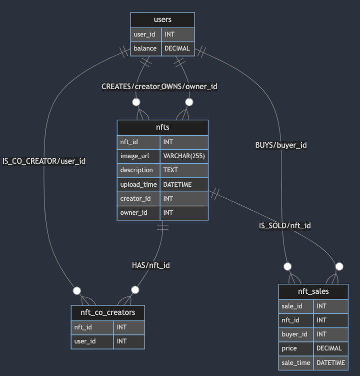
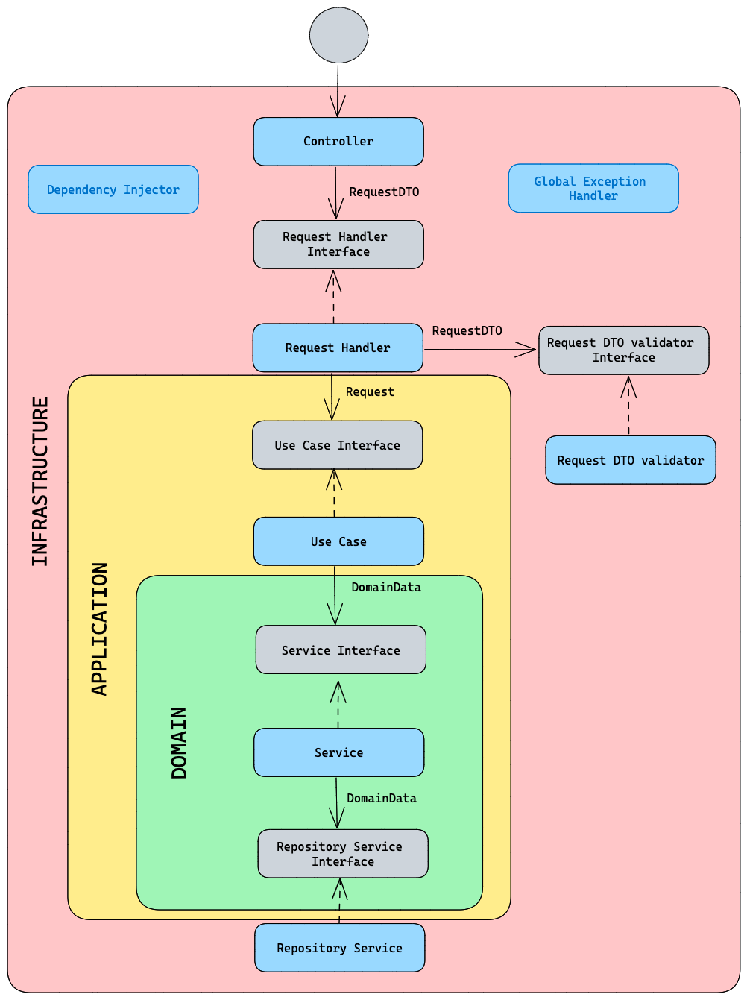

# API Documentation
## Use case: Upload NFT Image

### Request:
- **HTTP method**: POST
- **Endpoint**: `/api/nfts/images`
- **Headers**:
    - **Content-type**: multipart/form-data
- **Body**:
    - `image`: file.jpg / file.jpeg / file.png

### Response:

#### Status: 200
```json
{
  "imageUrl": "localhost:8080/api/nfts/images/File.jpg"
}
```

#### Status: 400

```json
Invalid image url: $imageUrl
```

```json
Image content type $contentType is not allowed
``` 

- Allowed content types:
  - image/jpeg
  - image/png

```json
Image extension $extension is not allowed
```

- Allowed extensions:
  - jpeg
  - png
  - jpg

## Use case: Get NFT Image

### Request:
- **HTTP method**: GET
- **Endpoint**: `/api/nfts/images/{imageName}`

### Response:

#### Status: 200
_With the image_

#### Status: 400

```json
Image name is required.
```

```json
Image extension $extension is not allowed
```

#### Status: 404

```json
Image $imageName not found
```

## Use case: Get All NFTs Paginated

### Request:
- **HTTP method**: GET
- **Endpoint**: `/api/nfts`
- **Query params**:
    - `page`: [1, ...] (*default*: 1)
    - `size`: [1, ...] (*default*: 3)

### Response:

#### Status: 200
```json
{
  "nftList": [
    {
      "nftId": "a5863ecd-cf41-4d18-ae2d-f5444e6be204",
      "imageUrl": "localhost:8080/api/nfts/images/Buenos-Aires.jpeg",
      "description": "Buenos Aires Gold NFT"
    },
    {
      "nftId": "a1b823ec-8ae9-4e3c-86f6-259059a87243",
      "imageUrl": "localhost:8080/api/nfts/images/Buenos-Aires.jpeg",
      "description": "Buenos Aires Gold NFT"
    },
    {
      "nftId": "265e90fd-6400-441b-b047-9154b8920f71",
      "imageUrl": "localhost:8080/api/nfts/images/Buenos-Aires.jpeg",
      "description": "Buenos Aires Gold NFT"
    }
  ],
  "page": 1,
  "size": 3,
  "totalElements": 4,
  "totalPages": 2
}
```

#### Status: 400

```json
Invalid page: ${request.page}. Page must be greater than 0.
```

```json
Invalid size: ${request.size}. Size must be greater than 0.
```

## Use case: Mint NFT

### Request:
- **HTTP method**: POST
- **Endpoint**: `/api/nfts`
- **Headers**:
  - **Content-type**: application/json
- **Body**:
  ```json
  {
    "creatorId": 444,
    "description": "Buenos Aires Gold NFT",
    "imageUrl": "localhost:8080/api/nfts/images/Buenos-Aires.jpeg",
    "coCreators": [
        111, 222
    ]
  }
  ```

### Response:

#### Status: 200
```json
{
  "nftId": "a5863ecd-cf41-4d18-ae2d-f5444e6be204",
  "imageUrl": "localhost:8080/api/nfts/images/Buenos-Aires.jpeg",
  "description": "Buenos Aires Gold NFT"
}
```

#### Status: 400

```json
Invalid creatorId: ${request.creatorId}. CreatorId must be greater than 0.
```

```json
Invalid coCreatorId: $coCreatorId. CoCreatorId must be greater than 0.
```

```json
Description is required.
```

```json
ImageUrl is required.
```

#### Status: 422

```json
Creator with id $creatorId not found
```

```json
Co-creator with id $coCreatorId not found
```

```json
Image not preloaded: $imageUrl
```


## Use case: Buy NFT

### Request:
- **HTTP method**: POST
- **Endpoint**: `/api/nfts/{nftId}/buy`
- **Headers**:
  - **Content-type**: application/json
- **Body**:
  ```json
  {
    "buyerId": 555,
    "amount": 50.0
  }
  ```

### Response:

#### Status: 200
```json
{
  "id": 1,
  "buyer": {
    "id": 555,
    "balance": 50.00
  },
  "oldOwner": {
    "id": 444,
    "balance": 143.33
  },
  "creators": [
    {
      "id": 444,
      "balance": 143.33
    },
    {
      "id": 111,
      "balance": 103.33
    },
    {
      "id": 222,
      "balance": 103.33
    }
  ],
  "nft": {
    "id": "657579fc-d2e2-49ac-a5df-dc7b0e5f26cc",
    "ownerId": 555
  },
  "price": 50,
  "time": "2023-10-30T01:04:03.167980505"
}
```

#### Status: 400

```json
Invalid buyerId: ${request.buyerId}. BuyerId must be greater than 0.
```

```json
NFTId is required.
```

```json
Invalid NFT price: ${request.amount}. Amount must be greater than 0.0.
```

#### Status: 422

```json
Buyer with id $buyerId not found
```

```json
Buyer $buyerId does not have enough balance to buy the NFT. Balance: $balance, NFT price: $nftPrice
```

```json
Buyer $buyerId is the owner of the NFT $nftId
```

#### Status: 404

```json
NFT $nftId not found.
```

# Data model


```
erDiagram
    users ||--o{ nfts : "CREATES/creator_id"
    users ||--o{ nfts : "OWNS/owner_id"
    users ||--o{ nft_sales : "BUYS/buyer_id"
    users ||--o{ nft_co_creators : "IS_CO_CREATOR/user_id"
    nfts ||--o{ nft_co_creators : "HAS/nft_id"
    nfts ||--o{ nft_sales : "IS_SOLD/nft_id"

    users {
        user_id INT
        balance DECIMAL
    }

    nfts {
        nft_id INT
        image_url VARCHAR(255)
        description TEXT
        upload_time DATETIME
        creator_id INT
        owner_id INT
    }

    nft_co_creators {
        nft_id INT
        user_id INT
    }

    nft_sales {
        sale_id INT
        nft_id INT
        buyer_id INT
        price DECIMAL
        sale_time DATETIME
    }
```


# Architecture

Each use case follows the next architecture:



# How to run

From the project directory run the command 

```
docker-compose up --build
```

# How to test

Import the file `Mighty Block Challenge.postman_collection.json` into Postman and run the requests.

# Improvements

- Magic numbers should be replaced by constants.
- The database should be in a separate container.
- Images should be stored in AWS S3.
- Monitors should be added to the application.
- Metrics should be added to the application.
- Code coverage should be added.
- The application should be deployed in a cloud provider.
- Block resources as buyer balance and nft when are being updated.
- Get and Update resources as co-creators in parallel or batch
- Add a cache for the NFTs
